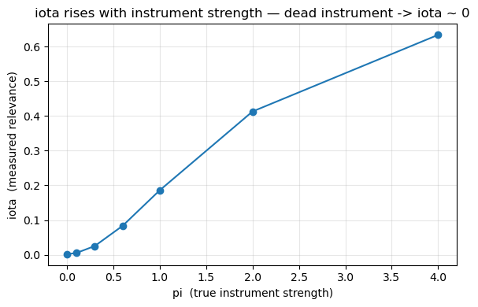
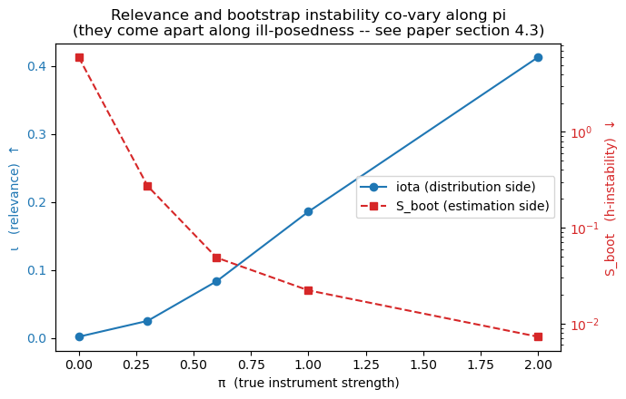

# Auditing DeepIV: relevance and reliability signals

Simulation code for *Auditing DeepIV: Relevance and Reliability Signals for Nonparametric
Instrumental-Variable Estimates* (submitted, ACM ICAIF 2026).

DeepIV estimates nonlinear causal effects under endogeneity, but — unlike linear IV with its
first-stage F-test — gives no operational warning when a fitted structural estimate should not be
trusted. This repository implements the audit proposed in the paper: a **Wasserstein relevance
index** for instrument strength, and **reliability signals** built from how much the fitted
structural function moves under resampling and under reseeding.

The central finding is that these are two distinct axes. In a controlled design where failure is
known, relevance alone predicts failure at chance level (leave-one-out CV AUC 0.43); adding a
reliability signal raises AUC to 0.69, with a bootstrap 95% confidence interval on the gain that
excludes zero. A relevance statistic should never be reported alone as evidence that a DeepIV
estimate can be trusted.

## What is here

```
notebooks/simulation_core.ipynb   data-generating process, relevance index,
                                  DeepIV in PyTorch, reliability signals
paper/                            the manuscript
```

The notebook is self-contained and runs end to end on CPU. It covers the components of the
paper's audit at a single setting of the design parameters; the full audit-utility grid (60
fitted pipelines over 5 relevance levels x 4 ill-posedness levels x 3 seeds, paper §4.4) is a
scaled-up sweep over the same functions.

## The audit



*The relevance index rises monotonically with true instrument strength and sits near zero for a
dead instrument.*


**Relevance.** `iota` measures how far the instrument shifts the treatment distribution, as a
normalised squared 2-Wasserstein distance between the conditional and marginal laws of `X`. It
depends on `(X, Z)` only — never on the outcome — which makes it a relevance diagnostic rather
than a validity test, and which is also why it cannot detect estimation failure on its own.

**Reliability.** `s_boot` refits DeepIV on bootstrap resamples and measures the disagreement
among the fitted structural curves. `s_seed` refits on the same data with different random seeds
and measures the disagreement due to optimisation alone. The paper's stronger signals are the
ones that contrast the two — `S_gap = S_boot - S_seed` and `S_rel = (S_boot - S_seed)/(S_seed +
eps)` — together with the relevance-residualised `S_res`.



*Relevance and bootstrap instability co-vary along instrument strength — which is why the paper
residualises one on the other. They come apart along ill-posedness, which the relevance index is
structurally blind to.*

**Why the contrast matters.** A deep pipeline is not a deterministic function of its data:
reseeding alone already moves the fitted curve. In the notebook's run, seed variation is of the
same order as bootstrap variation at weak instruments and the two become indistinguishable at
strong ones. An audit built on resampling alone therefore conflates data sensitivity with
optimisation noise.

**A degeneracy to guard against.** At the most ill-posed settings the bootstrap replicates agree
on a smooth estimate that omits the oscillatory component of the true structural function
entirely — they agree on the same wrong function, so the bootstrap signal can be small exactly
where the estimate is worst. Agreement among replicates certifies stability, not correctness.

## DeepIV implementation

EconML's original `DeepIV` was built on TF1 / Keras-2 graph mode and was removed in econml ≥
0.14. Rather than pin obsolete dependencies, DeepIV is implemented directly in PyTorch, following
the two-stage recipe of Hartford et al. (2017): a mixture-density network for `p(X | Z)`, then a
structural network fitted against the conditional mean of `Y` given `Z` by sampling from the
first-stage density. The implementation is deliberately compact and untuned.

## Running it

```bash
pip install -r requirements.txt
jupyter lab notebooks/simulation_core.ipynb
```

Run the cells top to bottom. The DeepIV sections refit the network many times and take a few
minutes on CPU.

## Scope and limitations

The design is univariate and has no controls, so it exercises neither the heterogeneity nor the
dimensionality that motivate DeepIV in practice. The DeepIV implementation is compact and untuned,
and in this design 2SLS outperforms it wherever confounding is strong enough to break OLS: the
results are about auditing a flexible pipeline, not about that pipeline's superiority. The audit
grid comprises 60 fitted pipelines with 3 replicates each, so differences among the reliability
signals are not resolved and the AUC estimates carry wide intervals. Bootstrap consistency for a
deep pipeline is assumed rather than proven.

None of these statistics tests instrument validity. The exclusion restriction remains an
untestable assumption, and a high relevance score with a clean reliability profile says nothing
about whether the instrument is legitimate.

## References

Borgonovo, Figalli, Plischke & Savaré (2024). Global sensitivity analysis via optimal transport.
*Management Science.*
Hartford, Lewis, Leyton-Brown & Taddy (2017). Deep IV. *ICML.*
Newey & Powell (2003). Instrumental variable estimation of nonparametric models. *Econometrica.*
